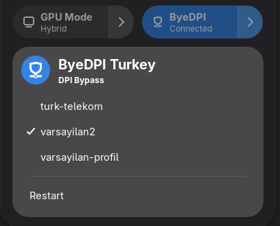

# ByeDPI Turkey - GNOME Extension

A GNOME Shell extension that adds a Quick Settings toggle for [byedpi-turkey](https://github.com/elrondforwin/byedpi-turkey) DPI bypass tunnel.



## Features

- **Quick Settings toggle** to start/stop the byedpi tunnel
- **Profile switching** from the dropdown menu
- **Active profile detection** with checkmark indicator
- **Auto-detect custom profiles** added to `/etc/byedpictl/profiles/`
- **Panel indicator** icon when the tunnel is active
- **Status polling** via the `byedpi-tun` network interface

## Requirements

- GNOME 49
- [byedpi-turkey](https://github.com/elrondforwin/byedpi-turkey) installed and configured

## Installation

```bash
git clone https://github.com/alhnesn/byedpi-turkey-gnome.git
cd byedpi-turkey-gnome
make install
```

Then restart GNOME Shell (log out and back in) and enable the extension:

```bash
gnome-extensions enable byedpi-turkey-gnome@alhnesn
```

Or enable it through the Extensions app.

## Uninstallation

```bash
make uninstall
```

## Usage

Open the Quick Settings panel (click the system menu in the top bar):

- **Click the toggle** to start or stop the tunnel (requires authentication via polkit)
- **Click the arrow** to open the dropdown menu:
  - Select a profile to switch to it (the active profile has a checkmark)
  - Click **Restart** to restart the tunnel

Profile switching preserves connection state: if the tunnel is running, it restarts with the new profile. If disconnected, it only changes the profile for the next start.

## Custom Profiles

Add `.conf` files to `/etc/byedpictl/profiles/`. They will appear in the dropdown menu automatically.

## Packaging

```bash
make zip
```

Creates `byedpi-turkey-gnome@alhnesn.zip` for distribution.

## License

MIT
